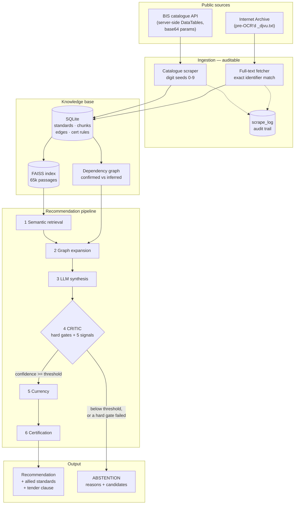
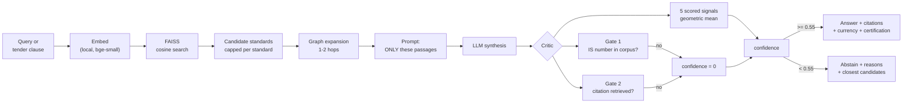
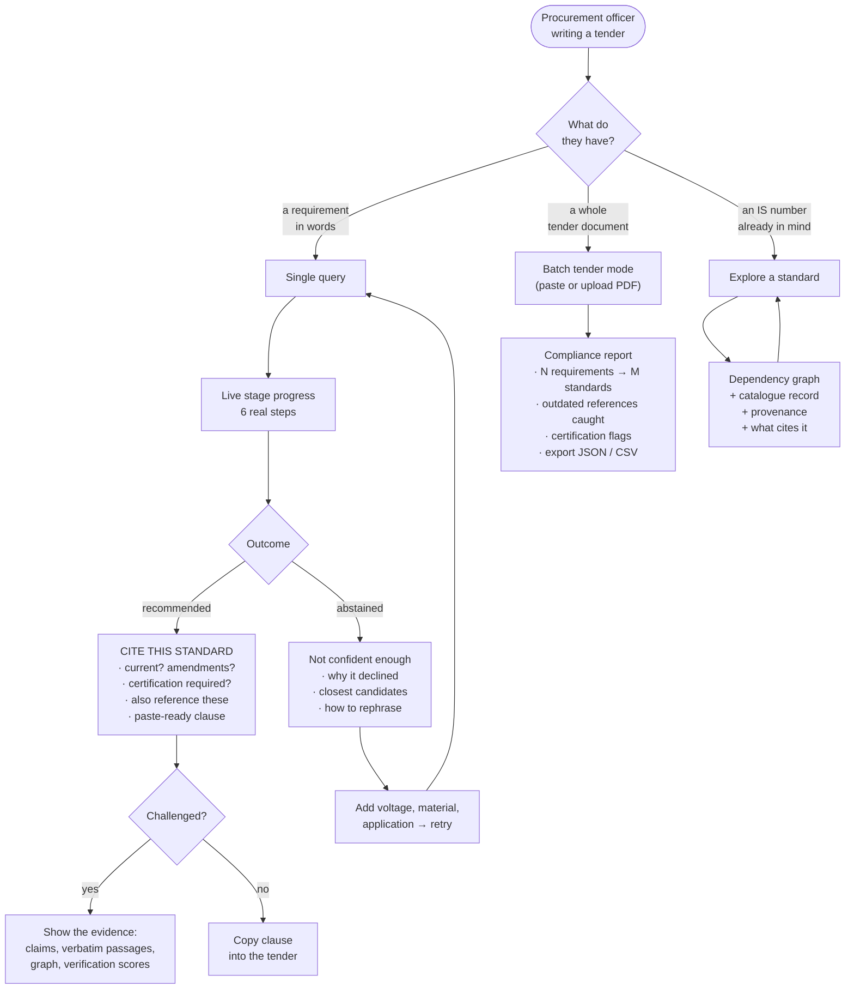

# Project Context

**AI-Powered Recommendation Engine for Indian Standards**
Smart India Hackathon 2026 · Problem Statement **SIH26108**
Ministry of Consumer Affairs, Food & Public Distribution (Department of Consumer Affairs)

---

## Index

1. [The problem](#1-the-problem)
2. [Requirements](#2-requirements)
3. [Expected features and what was built](#3-expected-features-and-what-was-built)
4. [Tech stack, and why each piece](#4-tech-stack-and-why-each-piece)
5. [Database schema](#5-database-schema)
6. [Features built, and how each works](#6-features-built-and-how-each-works)
7. [Architecture](#7-architecture)
8. [Data flow](#8-data-flow)
9. [User flow](#9-user-flow)
10. [Limitations](#10-limitations)
11. [Conclusion](#11-conclusion)

---

## 1. The problem

Government departments, PSEs and procurement agencies must reference the correct
Indian Standards when writing tender specifications. That is hard because:

- there are roughly **24,000 published standards**;
- their **scopes overlap**;
- they are **revised frequently**, so a number that was right five years ago may
  now be superseded or withdrawn;
- a standard rarely stands alone — it **normatively references** other standards
  (test methods, terminology, safety, installation practice) that the tender must
  also cite.

The consequences are concrete: tenders omit relevant standards, cite outdated
editions, or state incomplete technical requirements. That produces ambiguity,
reduced product quality, and procurement disputes.

### The failure mode that matters most

An obvious solution is "point a language model at it". That is worse than useless
here, because a language model will confidently produce a **plausible-looking IS
number that does not exist**, or one that exists but is wrong. In a government
tender that error is expensive and is often not caught until a dispute.

So the central engineering problem is not retrieval. It is **knowing when not to
answer**. This system is built so that a wrong-but-confident answer is treated as
a critical defect, and abstention is a first-class outcome.

---

## 2. Requirements

**Functional**

| # | Requirement |
|---|---|
| R1 | Accept a product description, a technical specification, or a full tender document |
| R2 | Recommend the relevant Indian Standard(s) by **semantic** understanding, not keyword match |
| R3 | Identify allied standards: normative references, test methods, terminology, safety, installation, related products |
| R4 | Highlight the latest published version and any amendments |
| R5 | Suggest mandatory certification (BIS Product Certification, CRS, Hallmarking) |
| R6 | Support multilingual input and natural-language queries |

**Non-functional (self-imposed, and the reason the project is credible)**

| # | Requirement |
|---|---|
| N1 | Never emit an IS number absent from the ingested corpus |
| N2 | Every claim traceable to a verbatim passage of a real standard |
| N3 | Abstain, with reasons, when evidence is insufficient |
| N4 | The dataset build must be inspectable, not a black box |
| N5 | Degrade visibly rather than silently (metadata-only, unverified edges, LLM outages) |

---

## 3. Expected features and what was built

| Expected feature | Status | Evidence |
|---|---|---|
| Accept descriptions / specs / tender documents | **Built** | Text and PDF upload both verified end-to-end |
| Semantic recommendation, not keyword | **Built** | `"earthing and bonding of electrical installation"` → **IS 3043** (*"Code of practice for earthing"*) — neither "bonding" nor "installation" is in that title |
| Allied standards, six categories | **Built** | All six edge types produced from BIS's own `aspect` taxonomy |
| Latest version and amendments | **Built** | `IS 1554 (Part 1):1988` → current, **5 amendments** flagged; `IS 3043-1987` → **superseded** by 2018 |
| Certification requirements | **Partial** | BIS Product Certification and CRS fire; **Hallmarking cannot** — it covers gold/silver (MTD department), and the ingested corpus is ETD/LITD |
| Multilingual input | **Not built** | Deliberate scope decision — see [Limitations](#10-limitations) |

---

## 4. Tech stack, and why each piece

| Layer | Choice | Why this, specifically |
|---|---|---|
| Scraping | **Plain HTTP** (`urllib`), Playwright for discovery only | The BIS catalogue is a server-side DataTables endpoint. Playwright was used **once** to capture the XHR contract; the scraper then dropped the browser entirely, which is far faster and has no runtime browser dependency |
| Full text | **Internet Archive `_djvu.txt`** | Public.Resource.Org mirrors BIS standards already OCR'd. Fetching plain text avoids downloading PDFs and running OCR ourselves. CC0 / RTI-released |
| Store | **SQLite** | Single-file, zero-admin, transactional. The corpus is ~5k rows and ~250 MB of text — Postgres would add operational cost for no benefit at this scale |
| Embeddings | **`BAAI/bge-small-en-v1.5`**, local | Runs offline with no API key and no per-query cost, which matters when a demo venue's network is unreliable. 384-dim, strong retrieval quality for its size |
| Vector index | **FAISS** (`IndexFlatIP`) | The brief suggested ChromaDB, but `chroma-hnswlib` has **no prebuilt Windows wheel** and needs MSVC build tools — the install silently rolled back the whole environment. FAISS ships Windows wheels. Flat inner-product on normalised vectors gives exact cosine, and at 65k vectors exact search is instant |
| Graph | **SQLite `edges` table** + traversal in SQL | The graph is ~10k edges. NetworkX or Neo4j would add a component without adding capability; SQL traversal keeps one source of truth and works before the vector index exists |
| LLM | **Groq, `openai/gpt-oss-120b`** | Fast hosted inference, generous free tier. Used only for synthesis, requirement extraction and entailment checking — never as the source of an IS number |
| API | **FastAPI** | Typed request models, automatic OpenAPI docs, and native streaming for live pipeline progress |
| Frontend | **React + Vite**, `react-force-graph-2d` | Vite for instant rebuilds; force-graph because the dependency web is the one thing genuinely better shown than described |
| GPU | **PyTorch `2.11.0+cu128`** | RTX 5050 is Blackwell (`sm_120`), which requires CUDA 12.8 kernels. Turned the index build from **87 minutes to 8** — a 17.5× speedup |

---

## 5. Database schema

Five tables. Trust is modelled explicitly in the schema rather than assumed.

```
standards                          the catalogue + ingested text
├─ is_number (unique)              "IS 1554 (Part 1):1988"
├─ is_base, part, section, year    parsed identity, for edition comparison
├─ title, technical_committee,
│  department, aspect              BIS catalogue fields
├─ amendment_count                 amendments issued against this edition
├─ is_active / withdrawn_status    'W' = withdrawn
├─ iso_equivalence,
│  iso_equiv_degree                BIS misnames this "referirmatin_year"
├─ full_text                       ingested document body
├─ full_text_year   ◄── TRUST      which EDITION the text came from
├─ metadata_only    ◄── TRUST      1 = content never verified
├─ archive_checked                 archive.org already searched (even if empty)
└─ archive_identifier              provenance: the exact source item

chunks                             the unit of CITATION
├─ id                              "IS 732:1989#c014" — stable, human-legible
├─ standard_id → standards
├─ section                         best-effort clause heading
└─ text, char_start, char_end      verbatim passage

edges                              the dependency graph
├─ src_standard_id → standards
├─ dst_is_base, dst_standard_id    late-bound; NULL = cited but not ingested
├─ edge_type                       normative_reference | test_method |
│                                  terminology | safety | installation |
│                                  related_product
├─ confidence       ◄── TRUST      'confirmed' (read from text) | 'inferred'
└─ evidence_section,
   evidence_snippet ◄── PROOF      the verbatim sentence establishing the edge

certification_rules                curated seed, NOT a legal source
├─ scheme                          BIS_PRODUCT_CERT | CRS | HALLMARKING
├─ match_type, match_value         is_base | department | keyword
└─ mandatory, authority, notes

scrape_log                         the audit trail (N4)
└─ run_id, phase, target, status, message, ts
```

**Why the trust columns exist.** `metadata_only`, `full_text_year`,
`archive_checked` and edge `confidence` are not bookkeeping — each one is a claim
the system would otherwise make silently and wrongly:

- `metadata_only` — we matched on a title, never on content
- `full_text_year` — the text we hold is from a *different edition* than the one
  being cited (true for roughly 80% of full-text standards)
- edge `confidence` — this relationship was read from the standard, or guessed

---

## 6. Features built, and how each works

### 6.1 Ingestion — building a corpus that can be audited

**BIS catalogue.** The "Know Your Standards" page renders through server-side
DataTables, so plain HTML returns an empty shell. The real endpoint is:

```
POST .../Indian_standards/searchIS?seachby=<base64>&txt_search=<base64>
```

The parameters are **base64-encoded** — sending plaintext returns HTTP 500, which
is what made the endpoint look unusable at first. The contract was recovered by
driving the page once in Playwright and capturing the outgoing request.

**Enumeration is provably complete.** Keyword search matches *word prefixes*, so
seeding with `"e"` returns 24,208 of ~24.2k rows and *looks* complete — while
silently missing any standard with no `e`-initial word in its title. That is how
**IS 8623 "Low-voltage switchgear and controlgear assemblies"** went missing from
an early run. Searching by IS *number* matches substrings, and every IS number
contains a digit, so the union of seeds `0`–`9` provably covers the catalogue.

**Full text** comes from the Internet Archive's pre-OCR'd `_djvu.txt`. Identifier
matching is anchored to number + part + section: prefix matching once attached
`gov.in.is.302.2.21.2018` (Part 2 **Section 21**) to Sections 28, 16, 36 and
twelve others — the right number over the wrong document. 147 rows were affected
and have been detached.

**Parse coverage is 99.3%.** The remainder are corrupt at source (BIS emits rows
with the number missing). They are **rejected and logged, never guessed**.

### 6.2 Knowledge base

Each standard is chunked at 1,800 characters (fills bge-small's 512-token window)
with 250 characters of overlap, preferring paragraph then sentence boundaries.
Every standard — including full-text ones — also gets a **title/metadata chunk**;
without it, retrieval is biased toward standards that happen to have full text,
and a metadata-only standard whose *title is the exact answer* gets buried.

Chunks are embedded locally and stored in FAISS with L2-normalised vectors, so
inner product is cosine similarity.

### 6.3 Dependency graph

Older Indian Standards have no formal "Normative References" clause — they cite
inline (`IS : 3043 - 1987`). So the whole document is scanned and the surrounding
sentence kept as **evidence**. Edge type comes from the cited standard's BIS
`aspect`, which maps almost one-to-one onto the categories the problem statement
asks for:

| BIS aspect | Edge type |
|---|---|
| Methods of tests | `test_method` |
| Terminology | `terminology` |
| Safety Standard | `safety` |
| Code of Practice / Service Specification | `installation` |
| Product Specification / Dimensions | `related_product` |
| *(anything else)* | `normative_reference` |

Where no full text exists, a **clearly-marked inferred** edge is proposed from
shared committee plus complementary aspect — capped and requiring title overlap,
because the unconstrained heuristic produced 10,491 noise edges that buried the
1,793 real ones.

### 6.4 The recommendation pipeline

Six stages, streamed to the UI as they run:

1. **Semantic retrieval** — top-k chunks, capped per standard so one verbose
   document cannot monopolise the candidates. Withdrawn standards are demoted for
   *ordering only*; the true similarity is preserved so confidence stays honest.
   Title matches outrank passing mentions.
2. **Graph expansion** — 1–2 hops from the top candidates.
3. **Synthesis** — the LLM sees *only* the retrieved passages and is told it may
   cite nothing else.
4. **Critic** — see below.
5. **Currency** — cited edition vs every edition of the *same document*.
6. **Certification** — rule-table lookup.

### 6.5 The critic — the core of the project

Two **deterministic hard gates** run before any scoring. They are set-membership
tests against the corpus, not model judgements, so they cannot themselves
hallucinate:

1. Every IS number named must exist in the corpus.
2. Every citation must point at a chunk that was actually retrieved.

Either failure forces confidence to `0.0`.

Then five scored signals combine as a **weighted geometric mean**, not a sum,
because the conditions are conjunctive — any near-zero factor must collapse the
result:

| Signal | What it catches |
|---|---|
| `grounding_rate` | Claims unsupported by the passage they cite |
| `retrieval_strength` | Nothing in the corpus matches closely |
| `discrimination` | Topically scattered candidates → the query is vague |
| `query_relevance` | A perfectly grounded answer to a *different* question |
| `verification_depth` | Match rests on metadata, or on another edition's text |

Plus a near-veto if the recommended standard is **withdrawn**.

> An additive score let strong retrieval carry an ungrounded claim over the line,
> and let good grounding mask weak retrieval. Multiplying fixed both.

`query_relevance` exists because grounding alone cannot catch the case where a
claim is perfectly supported by the passage it cites and still answers a
different question.

Below the threshold (default `0.55`) the system **abstains**: no IS number, the
reasons it declined, the closest candidates with why each was uncertain, and how
to rephrase.

### 6.6 Batch tender mode

Requirements are extracted by the LLM (regex cannot handle tender-clause
variety), commercial boilerplate skipped, then each requirement runs the same
pipeline. Aggregated into: requirements extracted → standards identified →
outdated references in the tender → certification flags → abstentions.

A cited edition is judged against the **newest edition in the catalogue**, not
against whether we hold that exact year — otherwise a tender citing a 1987
edition we never ingested resolves to the current row and is reported as up to
date, the opposite of the truth.

### 6.7 Output for a procurement officer

The default view answers the officer's actual question: **which standard to
cite**, whether it is current, whether certification applies, **what else to
reference**, and a **paste-ready specification clause**. All verification detail
sits behind *"Show the evidence"* — present when a decision is challenged,
absent when it is not.

---

## 7. Architecture



---

## 8. Data flow



**What travels with the answer.** Each claim carries the chunk ids it cites; each
chunk id resolves to a verbatim passage, a clause heading, and the standard it
came from. Nothing is asserted that cannot be walked back to a row in the store.

---

## 9. User flow



---

## 10. Limitations

Stated plainly, because volunteering them is what makes the rest credible.

**Corpus scope.** The ingested corpus is the **ETD and LITD** departments
(electrical and electronics), not all ~24,000 standards. Scaling is re-running
the scraper without the department filter — the pipeline does not change.

**Full-text coverage is partial.** Roughly **56%** of standards have ingested
text. The rest are matched on catalogue metadata only, are flagged
`metadata only — unverified` everywhere they appear, and carry reduced
confidence. They are not presented as verified.

**Most held text is from an earlier edition.** Around **80%** of full-text
standards hold text from a *different edition* than the catalogue lists, with
gaps of 13–39 years, because the Public.Resource.Org scanning effort predates
current BIS editions. This is tracked per standard (`full_text_year`), surfaced
as a currency flag, and it lowers confidence — but it means "verified against
source text" often means verified against an **older edition** of that standard.

**43% of the catalogue is withdrawn.** Those entries are kept deliberately (a
tender may cite one, and the user must be warned), but they are demoted in
retrieval and near-vetoed as a recommendation.

**Certification rules are a curated seed, not a legal source.** QCO coverage
changes by gazette notification. Output is phrased as a flag to verify.
**Hallmarking cannot fire** on this corpus at all — it covers gold and silver
(MTD department), which is not ingested.

**Colloquial phrasing degrades.** The system matches procurement language well
("PVC insulated copper conductor cable, 1100 V" → IS 694 at 0.88) but layperson
phrasing poorly ("bulb that saves electricity"). It **abstains rather than
answering wrongly**, so it fails safely — but it is a real boundary.

**Inferred graph edges are heuristics.** Rendered dashed and labelled unverified.

**Multilingual input is not implemented.** The standards themselves are published
in English; the intended design is translate-then-retrieve (detect language,
translate the requirement, run the same pipeline, answer in the original
language). It is a layer above the pipeline, not a change to it. Typing Hindi
today will most likely abstain — correct behaviour, but not a feature.

**LLM dependency.** Synthesis and requirement extraction need a hosted model.
When it is unavailable the system falls back to rule-based synthesis, still runs
the critic, and says so — it does not disguise an outage as an abstention.

---

## 11. Conclusion

The hard part of this problem is not finding a standard. Semantic search over
embedded text is well-understood, and any team can wire a language model to a
corpus and get plausible IS numbers out of it.

The hard part is that **a plausible wrong answer is worse than no answer**. A
fabricated or superseded IS number in a government tender is a real, expensive
error, and the person reading the output is not positioned to catch it.

So this system is built around refusal:

- an IS number that is not in the corpus **cannot** be emitted — that check is a
  database lookup, not a model judgement;
- every claim must be supported by a passage that was actually retrieved;
- five independent signals combine multiplicatively, so no single strength can
  paper over a weakness;
- when the evidence does not support an answer, it returns **nothing**, explains
  why, and hands back the closest candidates for a human to judge.

Everything else — the dependency graph, the currency checks, the certification
flags, the tender-ready clause — exists to make a correct answer *usable* by a
procurement officer. The abstention is what makes it *trustworthy*.

Measured behaviour on the current corpus: correct standards recommended with high
confidence for procurement-language queries (IS 694 at 0.88, IS 3043 at 0.78,
IS 16102 at 1.0), and clean abstention on vague input (0.30–0.43) — with zero
confident-but-wrong answers in the evaluation set.

> The goal was never a system that always answers. It was a system a procurement
> officer can trust — which requires it to be willing to say "I don't know".

---

### Where to look next

| Document | Contents |
|---|---|
| [README.md](README.md) | Setup, architecture summary, API table |
| [docs/RUNBOOK.md](docs/RUNBOOK.md) | Build, run, configure, troubleshoot |
| [docs/INGESTION.md](docs/INGESTION.md) | How the dataset was reverse-engineered and built |
| [docs/API.md](docs/API.md) | Full response schema and abstention triggers |